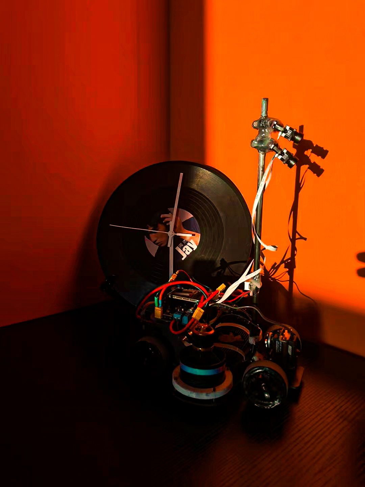
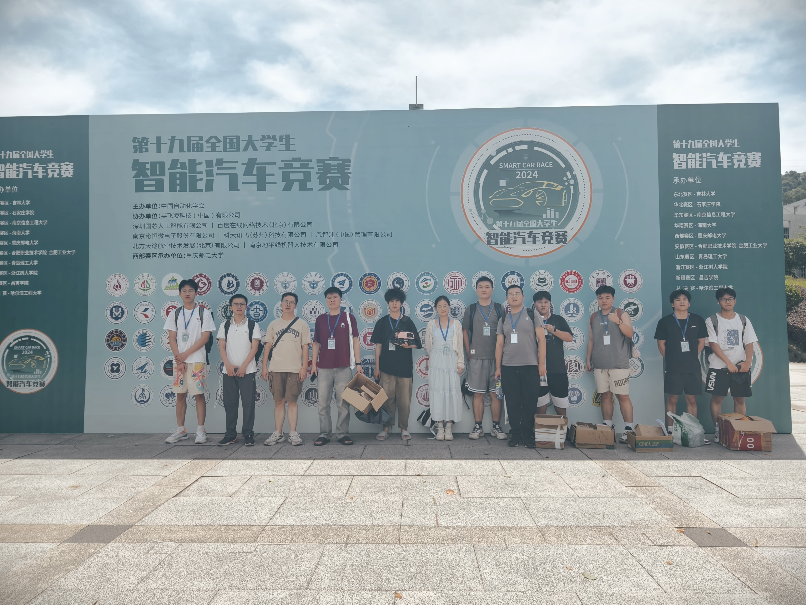

# 🏎️ CWNU-SmartCar-Lab 组织导航

**🌐 [English](./README_EN.md) | [简体中文](./README.md)**

*探索智能科技，驰骋开源世界*

---

## 📑 目录 (Table of Contents)
- [🔬 实验室介绍](#-实验室介绍)
- [⏱️ 考核时间与标准](#-考核时间与标准)
- [🗺️ 仓库指南](#-仓库指南)
- [🤝 致谢与贡献](#-致谢与贡献)
- [💌 寄语](#-寄语)

---

## 🔬 实验室介绍

欢迎来到 **CWNU-SmartCar-Lab**！
我们是一个成立于2022年专注于自动驾驶，图像处理，具身智能、SLAM 建图算法、底层电机控制以及嵌入式系统开发的智能车竞赛团队，在智能车嵌入式和机器人比赛中获得过多项国家级和省级奖项。在这里，代码与硬件碰撞出激情的火花，理论与实践结合于真实的赛道之上。我们致力于打破学科壁垒，培养具备软硬件全栈开发能力的工程师。

  

---

## ⏱️ 考核时间与标准

想要加入我们，与大神们并肩作战？以下是实验室新星计划的考核节点与通关秘籍：

* 传统嵌入式:掌握常见外设驱动方法，串口与其他通信方法，有一定控制理论基础
* Linux视觉:掌握Liunx下的环境开发，学会图像处理技术，能熟练使用opencv，对ROS系统有一定了解
* 硬件：熟悉原理图设计，芯片选型，PCB布局与绘制，电路焊接与修理,掌握3D打印技术。

| 考核阶段 |   时间安排   | 考核目标与通关标准                                                       |
| :---: |:--------:|:----------------------------------------------------------------|
| **初试 (Phase 1)** | 每年 9 月中旬 | **基础能力**                                                       |
| **终考 (Final)** | 每年 10 月底 | **项目实操** |

> **💡 提示:** 态度决定高度！相比于现有的技术储备，我们更看重你持续学习的能力、遇到 Bug 时死磕到底的韧性，以及团队协作精神。

---

## 🗺️ 仓库指南

我们通过 GitHub 管理并沉淀我们的核心技术资产。以下是组织内的核心仓库导航，分为开源与内部存档两部分：

### 🟢 开源项目 (Open Source)
*拥抱开源，与世界分享我们的轮子，欢迎 Star 和 Fork！*

| 仓库名称 |     领域标签     | 描述                                                                 | 传送门 |
| :--- |:------------:|:-------------------------------------------------------------------| :---: |
| **Lidar_SLAM_Car-RDKX5-** | `ROS` `SLAM` | **雷达建图上位机软件**：基于 RDK X5 平台的 LiDAR SLAM 算法实现与上位机控制系统部署。             | [🔗 访问仓库](https://github.com/CWNU-SmartCar-Lab/Lidar_SLAM_Car-RDKX5-) |
| **Lidar_SLAM_Car-STM32F411-** |  `Embedded`  | **雷达建图下位机及硬件**：包含底盘底层运动学解算、硬件驱动代码，以及核心硬件原理图与 PCB 设计文件。             | [🔗 访问仓库](https://github.com/CWNU-SmartCar-Lab/Lidar_SLAM_Car-STM32F411-) |
| **vofa_uart** | `vofa usart` | **串口条参代码和方法**：本仓库主要是用于串口调参的工具，使用vofa软件的Justfloat协议以及命令帧解析，可自定义响应帧。 | [🔗 访问仓库](https://github.com/CWNU-SmartCar-Lab/vofa_uart) |

### 🔴 内部项目 (Closed Source)
*实验室核心技术壁垒与历届传承，仅对组织内部成员开放。*

| 仓库名称 | 领域标签 | 描述 | 传送门 |
| :--- | :---: | :--- | :---: |
| **LADRC_Control** | `Control` | **LADRC 调参方法**：线性自抗扰控制 (LADRC) 算法实战落地、代码封装及详细调参指南。 | [🔒 内部访问](https://github.com/CWNU-SmartCar-Lab/LADRC_Control) |
| **Smart-Car-Private** | `Archive` | **往届核心代码库**：历届智能车比赛的优秀代码合集、方案设计图与复盘文档存档。 | [🔒 内部访问](https://github.com/CWNU-SmartCar-Lab/Smart-Car-Private) |

---

## 🤝 致谢与贡献

一个硬核实验室的成长，离不开每一位成员的辛勤付出和前人的技术沉淀：
* 感谢每一位熬夜看波形、调 PID、焊接板子的实验室前辈。
* 感谢开源社区提供的诸多优秀底层框架，让我们得以站在巨人的肩膀上。
* **贡献指南**：组织内的成员如需更新代码，请遵循 `Feature Branch` 工作流，积极提交 Pull Requests 并在合并前完成代码 Review。

---

### 📈 开源影响力 (Star History)

*见证我们开源项目的成长轨迹，感谢每一个为我们点亮 Star 的开发者！*

  <a href="https://star-history.com/#CWNU-SmartCar-Lab/CWNU-SmartCar-Lab&Date">
    <picture>
      <source media="(prefers-color-scheme: dark)" srcset="https://api.star-history.com/svg?repos=CWNU-SmartCar-Lab/CWNU-SmartCar-Lab&type=Date&theme=dark" />
      <source media="(prefers-color-scheme: light)" srcset="https://api.star-history.com/svg?repos=CWNU-SmartCar-Lab/CWNU-SmartCar-Lab&type=Date" />
      
    </picture>
  </a>

## 💌 寄语

> *"Talk is cheap. Show me the code... and let the car run!"*

愿你在这里不仅能敲出优雅高效的代码，更能结识一群志同道合的战友。在智能车的赛道上，不要害怕报错，勇敢地探索与试错，让你的代码在真实世界中全速驰骋！

---

  <b>Made with ⚡️ and 💻 by CWNU-SmartCar-Lab</b>

